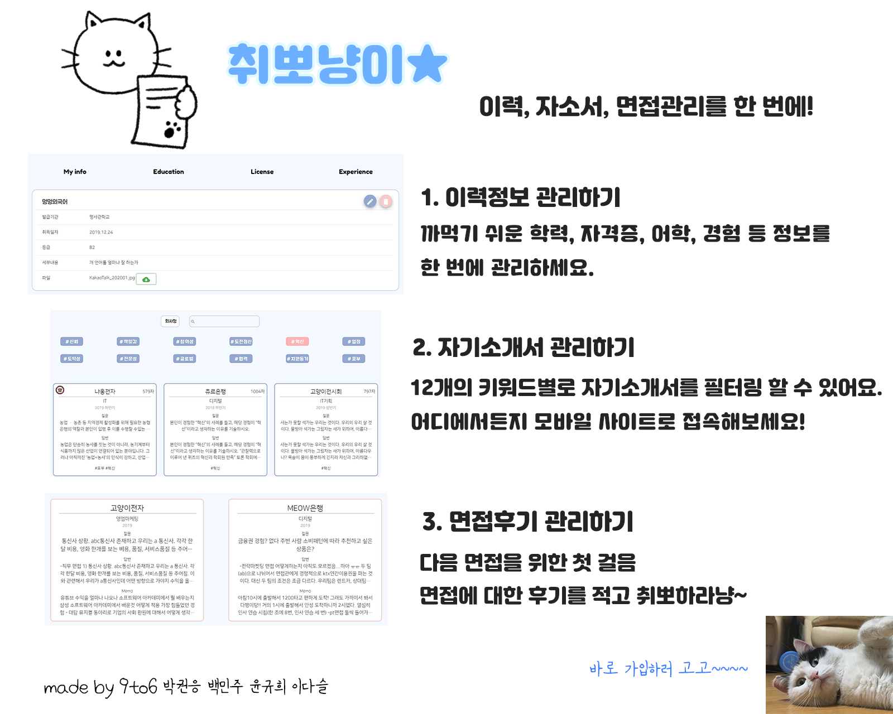
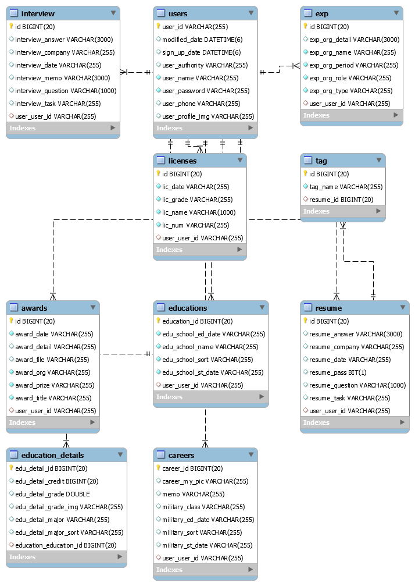

# 취뽀냥이  README

## http://i02a409.p.ssafy.io/

<hr>

## 한 줄 소개

내 취업 정보(정보, 자기소개서, 인터뷰)를 한 번에 관리하는 페이지 입니다.




## 목차

- 기술스택과 팀 소개
- 기획 의도
- ERD
- Frontend
- Backend
- 영상 링크
- 에필로그

<hr>

##  1. 소개

### 사용한 기술 스택

[](https://www.java.com/ko/) [](https://spring.io/projects/spring-boot) [](https://www.jetbrains.com/ko-kr/idea/) [](https://mariadb.com/) 

[](https://vuejs.org/) [](https://cli.vuejs.org/) [](https://code.visualstudio.com/) 


### 팀 소개

| 이름        | 역할                                                         |
| ----------- | ------------------------------------------------------------ |
| 박권응      | SCSS, Vue와 Vuetify를 활용한 페이지 구성 및 transition을 이용한 animation 효과, 비동기 처리 |
| 백민주      | Vue와 Vuetify 활용한 페이지 구성, Vuex 활용, Axios Rest-api를 이용한 백엔드와 통신 |
| 윤규희      | pringBoot Gradle, JPA로 Backend 개발, REST API 구현, jwt로 로그인, 메일, pdf  API 등 기술 사용 |
| 이다슬 팀장 | Java 기반의 RESTful API 구현, JPA를 활용한 DB 구축 및 연동, AWS EC2 환경 구축 및 사이트 배포 |


## 2. 기획의도

취업을 준비하는 사람 중 한 명으로서 취업정보를 한 번에 정리해주는 취업플랫폼이 있다면 편하지 않을까 생각을 해 보았다. 

1) 정보의 분산

면접 후기는 네이버 블로그에, 자기소개서는 컴퓨터 폴더에, 이력 정보는 엑셀 파일 관리하고 있으나 정보가 분산되어 있어 자기소개서를 작성하며 불편함을 느꼈다. 

2) 불편한 키워드 검색 기능

자기소개서를 쓸 때마다 기업이 요구하는 키워드에 맞게 글을 쓰기 위해 컴퓨터 자체의 검색기능을 활용해 키워드 검색을 할 수 밖에 없었다. 이를 해결하기 위해 #태그별 필터링 기능을 넣었다.

3) 글자수 파악의 어려움

내가 쓴 자기소개서의 글자를 직접 적어놓지 않는 이상 그 자기소개서 문항의 글자수를 파악하기 어려웠다. 

**따라서 자기소개서를 키워드로 관리해주면서 글자수까지 표시되어 자기소개서를 쉽게 쓸 수 있는, 더 나아가 이력과 면접후기 관리까지 할 수 있는 private한 사이트를 기획하게 되었다. **


## 3. ERD 구성




## 4. 홈페이지 소개 및  Frontend - Vue.js 

### 홈페이지 구성

## 부 기능

첫 접속 페이지


로그인 모달(google과 naver를 이용한 social login 구현)


회원가입 페이지(이메일 인증 구현)


내 정보 관리 페이지

팀 소개 페이지

또한 관리자만 접근할 수 있는 페이지로 회원정보 리스트를 보고 그 회원을 탈퇴시킬 수 있는 페이지가 존재한다.


## 주 기능

1. 이력 정보 관리 페이지

2. 자기소개서 관리 페이지(키워드별 필터링 가능, 검색 가능)

자기소개서 작성하기 / 자기소개서 Detail Modal

3. 면접 후기 관리 페이지

면접후기 작성하기 / 면접후기 Detail Modal


삼성 소프트웨어 아카데미에서 배운 Vue를 활용해 프로젝트를 진행했다. 

### 컴포넌트 구성

```
Components
|-----Homepage.vue
|-----Homepage.vue
|-----Homepage.vue
|-----Homepage.vue
|-----Homepage.vue
|-----Homepage.vue
|-----Homepage.vue
```

### 페이지 구성

```
Views
|-----Homepage.vue
|-----MainPage.vue
|-----InterviewPage.vue
|-----MyPage.vue
|-----ResumePage.vue
|-----Teampage.vue
|-----Userinfo.vue
|-----AdminPage.vue
```

### 설치하기

```
https://bit.dev/joshk/vue-spinners-css/ring-loader
npm install
npm run serve
```

vue-router와 vuex의 이용


## 5. Backend

### 기술스택

- IntelliJ로 Spring boot Gradle 형식으로 개발
- JPA를 사용한 데이터베이스와의 연동
- RESTful 개발
- Swagger을 활용한 REST API 문서화 제공
- AWS의 ec2의 서버의 MariaDB 사용

### 배포 방법

1. IntelliJ를 각각의 운영체제에 맞는 버전을 다운 받는다. 
2. /web-9to6/build/libs 아래의 XX.jar 파일을 ec2 server로 전송(winSCP를 사용하거나 scp -i "T02A409.pem 파일 경로" -r ./dist ubuntu@15.164.244.244:/home/ubuntu/web-9to6/back/)
3. ec2 server에서 cd web-9to6/back/로 이동 후 nohup java -jar XX.jar & 커맨드 실행

### 자기소개서를 PDF로 만들어 이메일로 내보내기

### Firebase를 이용한 이미지 관리 기능


## 6. 소개영상 링크(유튜브)

https://www.youtube.com/watch?v=1cyQnk2KHKc


## 7. 에필로그

### 느낀 점

박권응 : 6주동안 프로젝트 개발에만 몰두 하면서 SCSS, VueX 등 새로운 기술들을 공부해 적용할 수 있는 기회가 있어서 좋았고 다양한 시뮬레이션 테스트를 해보면서 어떻게 하면 문제가 적게 일어날수 있을 지 생각해보고 또 어떻게 하면 빠르게 문제를 해결할 수 있는지를 배울 수 있었던 것 같다.

백민주:

윤규희:  스케줄링을 잘해야할 필요성을 느꼈습니다. 서로 의사소통을 잘해야합니다. 

이다슬:  처음으로 기획부터 개발, 배포까지 전부 경험해볼 수 있었던 프로젝트라 어렵기도 했지만, 그만큼 재밌었어요ㅎㅎㅎ 이 프로젝트를 하면서 배운 것들로 다음에 또 멋진 프로젝트를 해보고 싶어요! 6주동안 함께한 팀원들한테도 정말 고맙고 대단하다고 말해주고 싶어요~~~ 고생많았어 정말로!!


